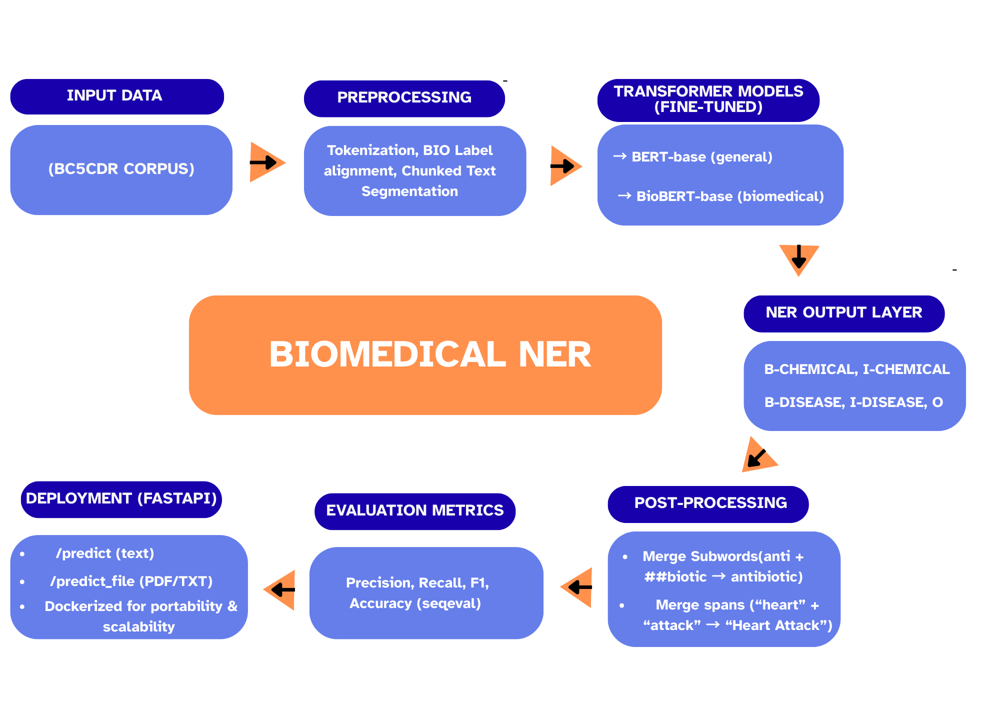

# **Fine Tuning BERT & BioBERT for Biomedical NER**

# **Objective**

- This project applies fine-tuning techniques on BERT and BioBERT to perform Named Entity Recognition (NER) on the BC5CDR dataset, focusing on extracting disease and chemical entities from biomedical text.
- It demonstrates model comparison, training, and evaluation for real-world healthcare NLP applications.

# **Datasets Information**

- **Dataset**: BC5CDR (BioCreative V Chemical Disease Relation) corpus.
- **Content**: 1,500 PubMed abstracts annotated with **1,551 chemicals**, **1,027 diseases**, and their relations.
- **Labels**: BIO tagging scheme (B-CHEMICAL, I-CHEMICAL, B-DISEASE, I-DISEASE, O).
- **Download Source**: [BioCreative V CDR Task](https://pubmed.ncbi.nlm.nih.gov/27161011/) / [Hugging Face Dataset](https://huggingface.co/datasets/tner/bc5cdr).

# **Business Impact**

- Healthcare Automation: This enables automatic extraction of critical medical information from patient records
- Clinical Decision Support: This assists healthcare providers in identifying key medical entities quickly.

# **Pipeline Architecture**

# **Demo**

# **Performance Metrics**

| Model                                                              | Precision      | Recall         | F1-Score       | Accuracy       |
| ------------------------------------------------------------------ | -------------- | -------------- | -------------- | -------------- |
| **Before Fine-Tuning (pre-trained BERT/BioBERT)**            | 0.65           | 0.68           | 0.66           | 0.88           |
| **After Fine-Tuning + Hyperparameter Tuning (BioBERT-base)** | **0.83** | **0.86** | **0.84** | **0.96** |

# **Key Highlights**

* Fine-tuned BioBERT on BC5CDR dataset, boosting F1-score by 27% and accuracy by 9%.
* Tuned hyperparameters to achieve 28% higher precision and 26% higher recall than baseline models.
* Achieved robust evaluation using seqeval metrics, ensuring reliable entity extraction across biomedical text.
